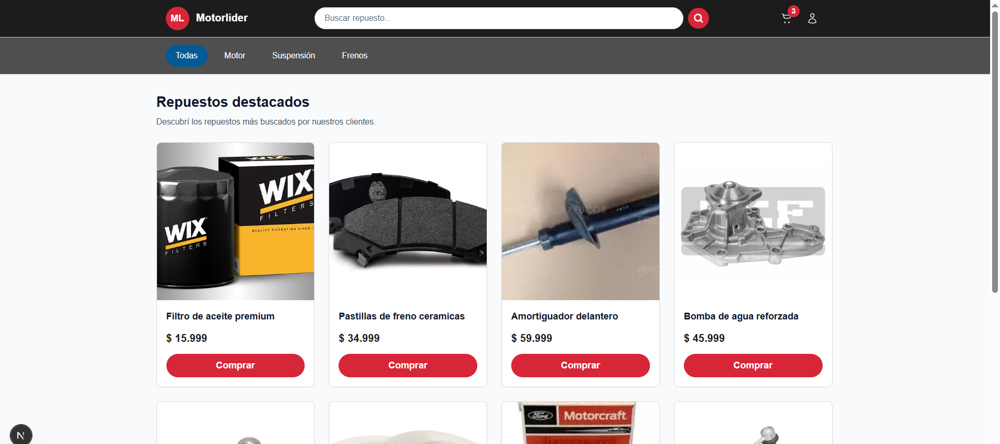

# Motorlider E-commerce Starter


Marketplace base para un e-commerce de repuestos construido con **Next.js 15**, **TypeScript** y **TailwindCSS**. Esta iteración incorpora persistencia real con Prisma, un panel de administración protegido y endpoints REST listos para integrarse con el storefront existente.


## Captura





## Stack


- Next.js 15 (App Router) + React 19

- TypeScript (`strict: true`) + Jest/ts-jest

- TailwindCSS 4

- Prisma ORM + SQLite (migrable a Postgres)

- Zod para validaciones

- Zustand para el carrito


## Funcionalidades Clave


### Storefront

- Home SSR/SSG consumiendo `/api/products` con fallback automático a mocks si la API falla.

- Búsqueda por `?q=` y filtro por categoría `?cat=` desde el servidor.

- `formatCurrency` normaliza valores en centavos (dos decimales).


### Backend & API

- Modelos `Category` y `Product` en Prisma (`prisma/schema.prisma`).

- CRUD REST bajo `/api/products` con respuestas `{ ok, data?, error? }`.

- Validaciones con Zod (`lib/validators/product.ts`) y manejo explícito de duplicados (409).

- Seed script (`tsx prisma/seed.ts`) con 3 categorias y 12 productos demo ejecutable con `npx prisma db seed`.


### Panel de Administración

- Middleware (`src/middleware.ts`) que exige un token (`ADMIN_TOKEN`) para `/admin/**` y métodos mutables en `/api/products`.

- Login minimalista en `/admin/login` que guarda cookie httpOnly.

- Listado `/admin/products` con búsqueda, filtros, paginación, edición y borrado con `ConfirmDialog` reutilizado.

- Formularios de creación/edición con validación cliente + toasts reutilizando la paleta existente.


### Carrito

- El store guarda los productos en una caché interna para cálculos en centavos y se persiste en localStorage (versión `motorlider-cart-v2`).

- Selectores derivados actualizados a la nueva estructura.


### Tests

- Pruebas de integración para POST/PATCH/DELETE en `test/api/products.test.ts` levantando una base SQLite temporal (Jest + Prisma).


## Estructura Destacada


```

src/

+- app/

¦  +- api/products/route.ts         # GET + POST

¦  +- api/products/[id]/route.ts    # GET + PATCH + DELETE

¦  +- admin/login/(page|route).tsx  # Login protegido

¦  +- admin/products/               # Listado + formularios

¦  +- cart/page.tsx                 # Carrito actualizado

¦  +- page.tsx                      # Home SSR con fetch a la API

+- lib/

¦  +- auth.ts                       # Helpers de autenticación admin

¦  +- db.ts                         # PrismaClient singleton

¦  +- products.ts                   # Fetch SSR + fallback a mocks

¦  +- slugify.ts                    # Normalización de slugs

¦  +- validators/product.ts         # Esquemas Zod

+- store/cart.ts                    # Store Zustand v2 (centavos)

+- data/                            # Mocks tipados (fallback)

+- test/api/products.test.ts        # Pruebas API

```


## Puesta en Marcha


```bash

npm install

npx prisma migrate dev --name init   # crea la primera migracion en SQLite

npx prisma db seed                   # carga categorias y productos demo

npm run dev                          # http://localhost:3000

```


Scripts útiles:


- `npx prisma studio` - Prisma Studio.

- `npm run test -- --runTestsByPath test/api/products.test.ts` ? pruebas API.


## Variables de Entorno


Crea un `.env` con al menos:


```

DATABASE_URL="file:./dev.db"

ADMIN_TOKEN="token-super-seguro"

NEXT_PUBLIC_APP_URL="http://localhost:3000"   # opcional pero recomendado para SSR en producción

```


### Cambiar a Postgres

1. En `prisma/schema.prisma` cambia `provider = "postgresql"` y ajusta `DATABASE_URL`.

2. Ejecuta `npx prisma migrate dev --name init-postgres`.

3. Actualiza `npx prisma db seed` o el contenido de `prisma/seed.ts` con datos compatibles.


## Notas


- Los precios se manejan en centavos (enteros) para evitar errores de coma flotante.

- Si la API no responde, `lib/products.ts` devuelve los mocks tipados para no romper el storefront.

- El panel admin exige estar autenticado; usa el token configurado y navega a `/admin/products` para CRUD completo.


---


Construido con foco en DX para acelerar la evolución del e-commerce Motorlider.

